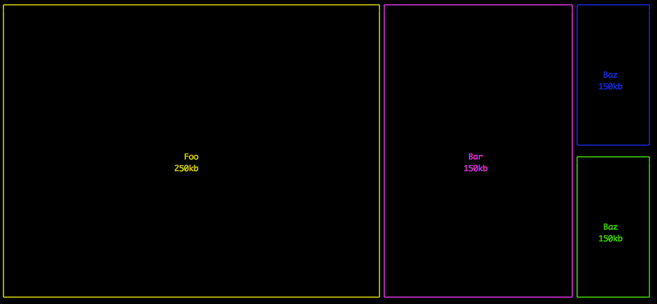

# terminal-treemap [](https://travis-ci.org/c0bra/terminal-treemap) [](https://codecov.io/gh/c0bra/terminal-treemap?branch=master)

> Treemaps in the terminal

## Install

```
$ npm install --save terminal-treemap
```


## Usage

```js
const terminalTreemap = require('terminal-treemap');

const data = [
	{ content: 'Foo\n250kb', value: 50 },
	{ content: 'Bar\n150kb', value: 25 },
	{ content: 'Baz\n150kb', value: 5 },
	{ content: 'Baz\n150kb', value: 5 },
];

const output = terminalTreemap(data);
console.log(output);
```


## API

### terminalTreemap(input)

Input should be an array of objects where each object has a `content` prop and a `value` prop. The value property will be used to ratio the size of the boxes in the terminal.

## Thanks

Inspiration from [boxen](https://www.npmjs.com/package/boxen) by [Sindre](https://github.com/sindresorhus/sindresorhus).


## License

MIT © [Brian Hann](http://n/A)
